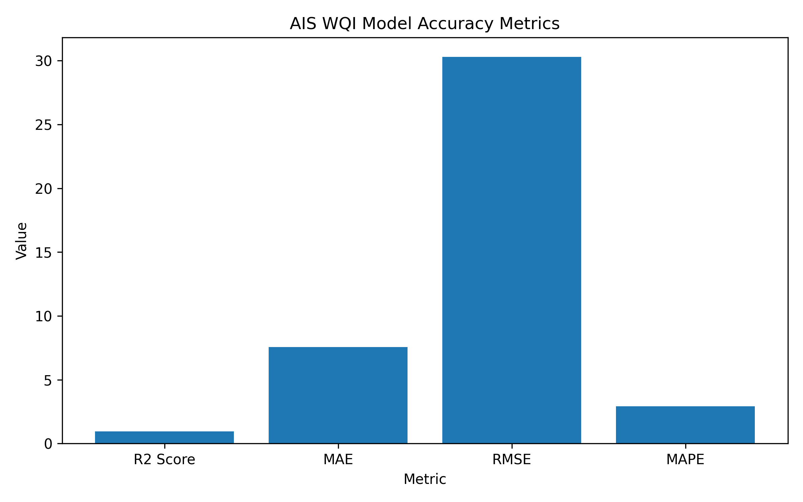

# 💧 Water Quality Index Prediction & Optimization System 
 
## 🧠 WQI Prediction using Bio-Inspired Optimization Algorithms and Machine Learning 

---

## 👤 Author

**Sagnik Patra**

---

## 📌 Project Overview

This project builds an end-to-end **Water Quality Index Prediction and Optimization System** using multiple **bio-inspired optimization algorithms** and a **Random Forest Regressor**.

The system uses water quality parameter data from `Results_MADE.csv`, performs intelligent feature selection using optimization algorithms such as **AIS**, **CSA**, **PSO**, and **QPSO**, predicts the **Water Quality Index (WQI)**, classifies water quality into meaningful categories, and automatically generates evaluation reports, graphs, heatmaps, prediction CSV files, trained models, and result summaries.

The project automatically generates:

- WQI prediction CSV files
- WQI class prediction CSV files
- Accuracy metric CSV files
- Selected feature CSV files
- JSON result summaries
- Actual vs predicted WQI graphs
- Accuracy graphs
- Optimization fitness graphs
- Feature selection graphs
- Confusion matrix heatmaps
- Correlation heatmaps
- Trained model `.pkl` files
- Scaler `.pkl` files

---



---

## 🎯 Objectives

- Analyze water quality parameter data
- Predict Water Quality Index using machine learning
- Apply bio-inspired feature selection algorithms
- Reduce unnecessary input features
- Improve model efficiency and prediction accuracy
- Compare actual and predicted WQI values
- Classify water quality into different categories
- Generate accuracy reports and visual graphs
- Save trained machine learning models
- Save scalers for future prediction use
- Generate heatmaps and confusion matrices
- Create a complete reproducible WQI research pipeline

---

## 📂 Dataset Used

The project uses the following dataset file:

```text
Results_MADE.csv
```

Expected dataset path:

```text
C:\Users\NXTWAVE\Downloads\WQI Research\archive (1)\Results_MADE.csv
```

Output folder:

```text
C:\Users\NXTWAVE\Downloads\WQI Research
```

---

## 📊 Dataset Columns

The dataset contains water quality parameters used to predict WQI.

### Input Features

```text
Temperature
Dissolved Oxygen
pH
Bio-Chemical Oxygen Demand
Faecal Streptococci
Nitrate
Faecal Coliform
Total Coliform
Conductivity
```

### Target Column

```text
WQI
```

The target column represents the **Water Quality Index** value calculated from water quality parameters.

---

## 🧪 Water Quality Classification

The predicted WQI values are classified into water quality classes.

```python
def classify_wqi(value):
    if value <= 25:
        return "Excellent"
    elif value <= 50:
        return "Good"
    elif value <= 75:
        return "Poor"
    elif value <= 100:
        return "Very Poor"
    else:
        return "Unsuitable"
```

---

## 🧬 Algorithms Used

This project uses the following bio-inspired optimization algorithms:

### 1. Artificial Immune System

**AIS** is inspired by the biological immune system.  
It selects the best feature subset by cloning, mutation, and immune memory-based optimization.

Generated files use the prefix:

```text
ais_
```

---

### 2. Cuckoo Search Algorithm

**CSA** is inspired by the brood parasitic behavior of cuckoo birds.  
It uses nest replacement and Levy-flight-style exploration to search for the best feature combination.

Generated files use the prefix:

```text
csa_
```

---

### 3. Particle Swarm Optimization

**PSO** is inspired by the social movement of birds and fish.  
Particles move through the search space to find the best feature subset.

Generated files use the prefix:

```text
pso_
```

---

### 4. Quantum-behaved Particle Swarm Optimization

**QPSO** is an improved version of PSO based on quantum behavior.  
It improves exploration and convergence while selecting useful WQI features.

Generated files use the prefix:

```text
qpso_
```

---

## 🤖 Machine Learning Model Used

The selected features from each optimization algorithm are passed into a:

```text
Random Forest Regressor
```

Random Forest is used because:

- It works well on small and medium tabular datasets
- It handles non-linear relationships
- It is robust to noise
- It provides stable prediction performance
- It works well with environmental data

---

## ⚙️ Project Workflow

```text
Load Results_MADE.csv
        ↓
Clean missing values
        ↓
Separate features and WQI target
        ↓
Train-test split
        ↓
Standard scaling
        ↓
Bio-inspired feature selection
        ↓
Train Random Forest Regressor
        ↓
Predict WQI
        ↓
Calculate accuracy metrics
        ↓
Classify WQI values
        ↓
Generate graphs and heatmaps
        ↓
Save CSV, PNG, PKL, and JSON outputs
```

---

## 📁 Project Folder Structure

```text
WQI Research/
│
├── archive (1)/
│   └── Results_MADE.csv
│
├── ais_wqi_project.py
├── csa_wqi_project.py
├── pso_wqi_project.py
├── qpso_wqi_project.py
│
├── ais_wqi_predictions.csv
├── ais_wqi_class_predictions.csv
├── ais_accuracy_metrics.csv
├── ais_selected_features.csv
├── ais_results_summary.json
├── ais_model.pkl
├── ais_scaler.pkl
│
├── csa_wqi_predictions.csv
├── csa_wqi_class_predictions.csv
├── csa_accuracy_metrics.csv
├── csa_selected_features.csv
├── csa_results_summary.json
├── csa_model.pkl
├── csa_scaler.pkl
│
├── pso_wqi_predictions.csv
├── pso_wqi_class_predictions.csv
├── pso_accuracy_metrics.csv
├── pso_selected_features.csv
├── pso_results_summary.json
├── pso_model.pkl
├── pso_scaler.pkl
│
├── qpso_wqi_predictions.csv
├── qpso_wqi_class_predictions.csv
├── qpso_accuracy_metrics.csv
├── qpso_selected_features.csv
├── qpso_results_summary.json
├── qpso_model.pkl
├── qpso_scaler.pkl
│
├── ais_actual_vs_predicted.png
├── ais_accuracy_graph.png
├── ais_fitness_graph.png
├── ais_feature_selection.png
├── ais_confusion_matrix.png
├── ais_correlation_heatmap.png
│
├── csa_actual_vs_predicted.png
├── csa_accuracy_graph.png
├── csa_fitness_graph.png
├── csa_feature_selection.png
├── csa_confusion_matrix.png
├── csa_correlation_heatmap.png
│
├── pso_actual_vs_predicted.png
├── pso_accuracy_graph.png
├── pso_fitness_graph.png
├── pso_feature_selection.png
├── pso_confusion_matrix.png
├── pso_correlation_heatmap.png
│
├── qpso_actual_vs_predicted.png
├── qpso_accuracy_graph.png
├── qpso_fitness_graph.png
├── qpso_feature_selection.png
├── qpso_confusion_matrix.png
└── qpso_correlation_heatmap.png
```

---

## 📌 Output Files Generated

### AIS Output Files

```text
ais_wqi_predictions.csv
ais_wqi_class_predictions.csv
ais_accuracy_metrics.csv
ais_selected_features.csv
ais_results_summary.json
ais_actual_vs_predicted.png
ais_fitness_graph.png
ais_feature_selection.png
ais_accuracy_graph.png
ais_confusion_matrix.png
ais_correlation_heatmap.png
ais_model.pkl
ais_scaler.pkl
```

---

### CSA Output Files

```text
csa_wqi_predictions.csv
csa_wqi_class_predictions.csv
csa_accuracy_metrics.csv
csa_selected_features.csv
csa_results_summary.json
csa_actual_vs_predicted.png
csa_fitness_graph.png
csa_feature_selection.png
csa_accuracy_graph.png
csa_confusion_matrix.png
csa_correlation_heatmap.png
csa_model.pkl
csa_scaler.pkl
```

---

### PSO Output Files

```text
pso_wqi_predictions.csv
pso_wqi_class_predictions.csv
pso_accuracy_metrics.csv
pso_selected_features.csv
pso_results_summary.json
pso_actual_vs_predicted.png
pso_fitness_graph.png
pso_feature_selection.png
pso_accuracy_graph.png
pso_confusion_matrix.png
pso_correlation_heatmap.png
pso_model.pkl
pso_scaler.pkl
```

---

### QPSO Output Files

```text
qpso_wqi_predictions.csv
qpso_wqi_class_predictions.csv
qpso_accuracy_metrics.csv
qpso_selected_features.csv
qpso_results_summary.json
qpso_actual_vs_predicted.png
qpso_fitness_graph.png
qpso_feature_selection.png
qpso_accuracy_graph.png
qpso_confusion_matrix.png
qpso_correlation_heatmap.png
qpso_model.pkl
qpso_scaler.pkl
```

---

## 📈 Evaluation Metrics

The model is evaluated using the following regression metrics:

### R² Score

Measures how well the model explains the variation in WQI values.

```text
Higher R² score means better prediction performance.
```

---

### MAE

Mean Absolute Error measures the average absolute difference between actual and predicted WQI.

```text
Lower MAE means better model performance.
```

---

### RMSE

Root Mean Squared Error gives higher penalty to large prediction errors.

```text
Lower RMSE means more accurate predictions.
```

---

### MAPE

Mean Absolute Percentage Error shows the prediction error in percentage form.

```text
Lower MAPE means better percentage-level prediction accuracy.
```

---

## 📊 Graphs Generated

### 1. Actual vs Predicted WQI Graph

Shows the comparison between real WQI values and predicted WQI values.

Example:

```text
ais_actual_vs_predicted.png
```

---

### 2. Accuracy Graph

Shows the model performance metrics visually.

Example:

```text
ais_accuracy_graph.png
```

---

### 3. Optimization Fitness Graph

Shows how the optimization algorithm improves over generations.

Example:

```text
ais_fitness_graph.png
```

---

### 4. Feature Selection Graph

Shows which features were selected by the optimization algorithm.

Example:

```text
ais_feature_selection.png
```

---

### 5. Confusion Matrix Heatmap

Shows classification performance after converting WQI values into water quality classes.

Example:

```text
ais_confusion_matrix.png
```

---

### 6. Correlation Heatmap

Shows relationships among water quality parameters and WQI.

Example:

```text
ais_correlation_heatmap.png
```

---

## 🧾 Prediction CSV Format

Each prediction CSV contains:

```text
Original feature values
Actual_WQI
Predicted_WQI
Error
```

Example file:

```text
ais_wqi_predictions.csv
```

---

## 🧾 Class Prediction CSV Format

Each class prediction CSV contains:

```text
Actual_WQI
Predicted_WQI
Actual_Class
Predicted_Class
```

Example file:

```text
ais_wqi_class_predictions.csv
```

---

## 🧬 Feature Selection CSV Format

Each selected feature CSV contains:

```text
Feature
Selected
```

Where:

```text
1 = Feature selected
0 = Feature not selected
```

Example file:

```text
ais_selected_features.csv
```

---

## 🧠 Model Saving

Each algorithm saves its trained Random Forest model as a `.pkl` file.

Example:

```text
ais_model.pkl
csa_model.pkl
pso_model.pkl
qpso_model.pkl
```

These files can be reused later for prediction without retraining.

---

## ⚖️ Scaler Saving

Each algorithm also saves its fitted scaler as a `.pkl` file.

Example:

```text
ais_scaler.pkl
csa_scaler.pkl
pso_scaler.pkl
qpso_scaler.pkl
```

The scaler is required because the model is trained on standardized feature values.

---

## 🛠️ Technologies Used

```text
Python
NumPy
Pandas
Matplotlib
Scikit-learn
Random Forest Regressor
Bio-Inspired Optimization
Machine Learning
Water Quality Analytics
```

---

## 📦 Required Libraries

Install the required Python libraries using:

```bash
pip install pandas numpy matplotlib scikit-learn
```

---

## ▶️ How to Run the Project

### Step 1: Keep Dataset in Correct Folder

Place the dataset at:

```text
C:\Users\NXTWAVE\Downloads\WQI Research\archive (1)\Results_MADE.csv
```

---

### Step 2: Open Command Prompt

Go to the project folder:

```bash
cd "C:\Users\NXTWAVE\Downloads\WQI Research"
```

---

### Step 3: Run AIS Code

```bash
python ais_wqi_project.py
```

---

### Step 4: Run CSA Code

```bash
python csa_wqi_project.py
```

---

### Step 5: Run PSO Code

```bash
python pso_wqi_project.py
```

---

### Step 6: Run QPSO Code

```bash
python qpso_wqi_project.py
```

---

## 🧪 Sample Console Output

```text
Generation 1/40 | Best R2: 0.9124 | Selected Features: 6
Generation 2/40 | Best R2: 0.9271 | Selected Features: 7
Generation 3/40 | Best R2: 0.9398 | Selected Features: 5
...
PROJECT COMPLETED

R2 Score: 0.9567
MAE: 2.3145
RMSE: 3.1208
MAPE: 4.7821%

Selected Features:
- Dissolved Oxygen
- pH
- Bio-Chemical Oxygen Demand
- Nitrate
- Conductivity
```

---

## 📌 Result Summary JSON

Each algorithm saves a JSON summary file.

Example:

```text
ais_results_summary.json
```

It contains:

```json
{
    "algorithm": "Artificial Immune System Feature Selection + Random Forest Regressor",
    "dataset_path": "C:\\Users\\NXTWAVE\\Downloads\\WQI Research\\archive (1)\\Results_MADE.csv",
    "total_rows": 295,
    "total_features": 9,
    "selected_features": [
        "Dissolved Oxygen",
        "pH",
        "Nitrate",
        "Conductivity"
    ],
    "r2_score": 0.9567,
    "mae": 2.3145,
    "rmse": 3.1208,
    "mape": 4.7821,
    "output_folder": "C:\\Users\\NXTWAVE\\Downloads\\WQI Research"
}
```

---

## 📊 Comparative Algorithm Study

This project can be used to compare the performance of:

```text
AIS vs CSA vs PSO vs QPSO
```

Comparison can be done using:

- R² Score
- MAE
- RMSE
- MAPE
- Number of selected features
- Optimization fitness progress
- Confusion matrix performance
- Prediction error

---

## 🏆 Expected Outcome

The system produces:

- Optimized feature subsets
- Accurate WQI prediction results
- Water quality class predictions
- Performance evaluation metrics
- Machine learning models
- Graphical visualizations
- Research-ready outputs
- A complete comparative study of optimization algorithms

---

## 🔮 Future Enhancements

- Add more machine learning models such as XGBoost, LightGBM, and SVR
- Add deep learning models such as ANN and LSTM
- Build a web dashboard using Streamlit or Flask
- Add real-time water quality prediction
- Add satellite-based water quality estimation
- Include geographical mapping of water quality
- Compare more optimization algorithms
- Add ensemble prediction using multiple optimized models

---

## 📚 Research Applications

This project is useful for:

- Environmental monitoring
- Water quality assessment
- River and lake pollution analysis
- Smart city water monitoring
- Remote sensing-based water studies
- Machine learning research
- Bio-inspired optimization research
- Academic final-year and M.Tech projects

---

## ✅ Conclusion

This project presents a complete **Water Quality Index Prediction System** using machine learning and bio-inspired optimization algorithms.

By combining **AIS**, **CSA**, **PSO**, and **QPSO** with a **Random Forest Regressor**, the system selects important water quality features, predicts WQI values, classifies water quality, and generates complete reports and visualizations.

The project is suitable for academic research, environmental analytics, and machine learning-based water quality monitoring.

---

## 👤 Author

**Sagnik Patra**

---
